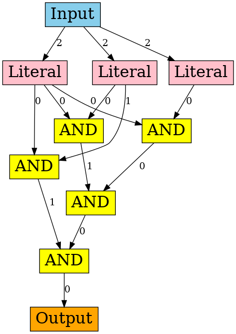

# Circuit Representation Learning and Its Applications to VLSI Testing 
This repo contains the initial codes and docs for circuit representation learning.

So far, the idea is to transform Conjunctive Normal Form (CNF) into And-Inverter Graph (AIG), then using circuit synthesis tools (*e.g.*, abc) to simplify AIG into the optimized AIG. 
Then our graph neural networks are constructed based on extracted AIG structure. 
In this way, we have two kinds of nodes: AND node and NOT (negative) node. Attention mechanism and heterogeneous graph embedding may be considered further.

For the first phase, let's just try whether building an AIG graph and considering in the circuit structure will help solving SAT or not!

After doing survey on the deep learning on EDA, I might just focus on proposing a better GNN for SAT solving. At least the idea of applying GNN to EDA/VLSI testing has been used.

## CNF->AIG->Optimzed AIG
### Libraries
The libraries we need:
1. [abc](https://github.com/berkeley-abc/abc): System for sequential logic system and formal verification;
2. [AIGER](http://fmv.jku.at/aiger/): A format, library and sets of utilities for And-Inverter Graphs (AIGs);
3. [CNFtoAIG](http://fmv.jku.at/cnf2aig/): A converter extracts an AIG in AIGER format from a CNF in DIMACS format;
4. [PyMiniSolvers](https://github.com/liffiton/PyMiniSolvers): a Python API for the MiniSat and MiniCard constraint solvers.

The downloading and installation of these libraries are packed in [setup.sh](setup.sh).

### Workflow
* [**Step1**](scripts/gen_dimacs.sh): *PyMiniSovlers* to generate SAT and UNSAT pairs in *dimacs* format, which representing the propositional equations as CNF;
* [**Step2**](scripts/dimacs2aig.sh): *CNFtoAIG* to convert the CNF circuits into AIG circuits;
* [**Step3**](scripts/aig2aigabc.sh): *ABC* to optimize AIG and output optimized AIG, which is usually be done for synthesis. The optimization process follows the [demo example](https://github.com/berkeley-abc/abc/blob/master/src/demo.c): 1, (Balancing) `balance`; 2, (Synthesis) `balance; rewrite -l; rewrite -lz; balance; rewrite -lz; balance`; 3, (Verification) `ces`; 4, Save AIG `write *.aig`. I assume the networks before and after synthesis are equivalent.
* [**Step4**](scripts/aig2aigabc.sh): *aigtoaig* (utilities in *AIGER*) to convert binary AIGER format (\*.aig) into ASCII AIGER (\*.aag) format.
* [**Step5**](scripts/aigabc2igraph.sh): Parse and construct graphs in [igraph](https://github.com/igraph/python-igraph) format with generated AIG circuits.

All steps can be done using [bash scripts](scripts/data_gen.sh).

**IMPORTANT**: During abc optimization, some UNSAT graph will be eliminated to a single NEGATIVE output (around 14%). This observation might be useful later, also reflect the internal structure of UNSAT graph to some extends.

The optimized AIG looks like as follow:

## Graph Neural Networks
The exact structure/representation of GNNs for AIG graphs is still to be determined.
I might first consider the intrinsic properties of [AIG](https://en.wikipedia.org/wiki/And-inverter_graph), and their AND nodes/Inverter edges.

Also, C-VAE, [D-VAE](https://github.com/muhanzhang/D-VAE), Attention Mechanism and Heterogeneous Graph Embedding can be referred.

I think using an adjacency matrix to represent the ordering of the nodes and the connections between nodes would be a feasible solution.

### Motivation
If AIG representation works, the motivation behind it is quite similar to the one described in [Applying Logic Synthesis for Speeding Up SAT](https://www.researchgate.net/profile/Niklas_Een/publication/220944461_Applying_Logic_Synthesis_for_Speeding_Up_SAT/links/00b7d537cde06c8184000000.pdf). Also, the creator of *abc* also published a paper [Circuit-Based Intrinsic Methods to Detect Overfitting](http://proceedings.mlr.press/v119/chatterjee20a.html), which might be useful later.

### IGraph structure
For AIG, the nodes can be categorized as the input node, internal AND nodes, the output node. The type values for each kind of nodes are as follows:
* Input node: 0 (one single virtual starting node, be compatible with D-VAE);
* Literal input node: 1 (input nodes, have a common predecessor Input node);
* Internal AND nodes: 2;
* Output node: 3 (connect to the last-level AND gate, but the edge might be Inverter).

The type values for non-inverter and inverter edge:
* Non-inverter: 0;
* Inverter: 1;
* Edges from the virtual starting node to literal input nodes: 2.

### GNN design
The functionals and information propagation mechanism of GNN. The implementation details are listed as follows.
* Inverter and Un-Inverter edges shouldn't share the weights (GRU cells). Or should we add an edge vector to embed such information? For now, I used one-hot vectors to encode edge information.
* **Assume the present ordering of vertices is the topological ordering. Need to check later.** seems to be not neccesary.
* Bi-direction is used, following the convention of *NeuronSAT* and *Learning to Solve SAT*.
* Should we add MLPs before GRU layer, just like what they do in *NeuronSAT*.
  
Two implementations right now:
1. (DVAEEncoder) GNN with one LSTM. Edge types are encoded as one-hot vectors.
2. (DVAEEdgeEncoder) GNN with two LSTMs. One for vertices with aggeration function, the other for edge.

### Training configuration
* ~~Haven't considered the multiple-round information propagations. Such implementation is not used in DVAE. I should turn to NeuronSAT for reference then.~~
* ~~The network is not optimized for the objective. I should check the NN functionality as soon as possible.~~
* The learning rate and the hyperparameter setting of optimizer are critical.
* Should we consider using the hidden state of edges of the last step as the input of hidden state updating? Right now we only consider the neighbor nodes' state.
* I should write a customed Pytorch loader for graph.

### Problem
1. Are Permutation invariance and negation invariance (mentioned in *NeuronSAT*) existing in AIG representation? 
   > D-VAE has addressed this problem.
2. How to solve SAT problem in a sensible way?
3. For the circuit representation learning, should we start from the generative model (learning graph distribution *p(x)*), or start from a supervised task (solving SAT)? From my view, it would be much easier to start from a supervised task.
4. The size of obtained AIG seems to be quite complicated.

### TO DO
- [x] Generate SR3to10 optimized AIG dataset.
- [x] Try small-size problems, *i.e.*, r3 problems.
- [ ] Try the loss used in *least square gan*.
- [x] Invert the hidden state if the edge is the invertor.
- [ ] Try other aggregation approaches.
- [ ] Re-implement the graph construction part. Right now the speed is not satisfactory.

### Results:
1. Baseline: encoding invertor/non-invertor as one-hot edge vector, model: DVEEncoder. Hidden size: 512. Bi-directional. Batch size. The number of rounds: 10. Acc on training data: 98.19%; Acc on testing data: 95.61%.

